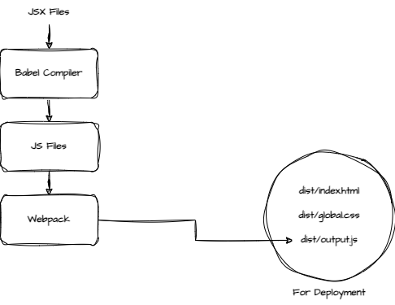

# Corn.js

Welcome to **Corn.js**, a small library created as part of a study of React, JSX, Babel, and Webpack. This project is a hobby effort aimed at exploring and understanding these technologies.

## 🚀 Features

- **JSX Support**: Write HTML-like code directly within JavaScript using JSX.
- **setState**: We have setState similar to React.
- **No Diffing**: Currently, there is no any overhead of diffing, entire tree is rerendered on state change.

## 📦 Installation

To get started with Corn.js, clone this repository and install the dependencies:

```bash
git clone https://github.com/imp-sike/corn.js.git
npm install
npm run build
```

This will create a `dist` folder with the files which can be run using "Live Server" or anything like that.

Check example at [Example](https://imp-sike.github.io/corn.js/dist/)

## Working


## 🤔 Contributing

Contributions are welcome! If you have suggestions, improvements, or bug reports, please open an issue or submit a pull request.

## 📄 License

This project is licensed under the MIT License.

## 🧑‍💻 Author

**Corn.js** was created by [imp-sike](https://github.com/imp-sike) as a hobby project.
